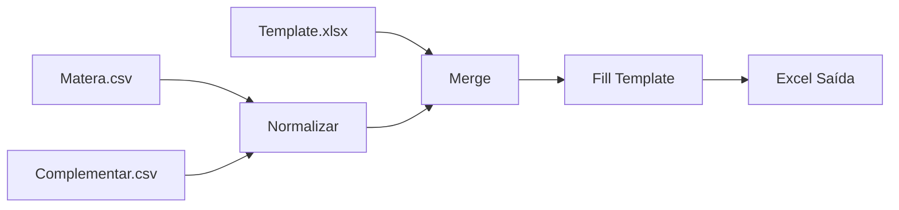

# 📊 Integrador de Planilhas Financeiras

> **Automação inteligente para consolidação de dados financeiros com validação de integridade**

## 🎯 O que faz

Consolida automaticamente três fontes de dados financeiras:
- **Matera** (Fonte de Verdade)
- **Complementar** (Fonte de Suporte)
- **Template** (Layout Obrigatório)

Com recursos como:
- ✅ Normalização automática de chaves
- ✅ Merge inteligente com priorização
- ✅ Validação de integridade
- ✅ Interface Streamlit
- ✅ CLI robusta
- ✅ Testes unitários

---

## 📚 Documentação

### Para Iniciantes
1. **[QUICK_START.md](QUICK_START.md)** - Começar em 2 minutos ⚡
2. **[EXEMPLOS.md](EXEMPLOS.md)** - Casos de uso práticos 📚

### Para Desenvolvedores
3. **[README.md](README.md)** - Documentação técnica completa 🔧
4. **[CONFIGURACAO.md](CONFIGURACAO.md)** - Deploy e instalação 🚀

---

## 🚀 Início Rápido

### Opção 1: Streamlit (Recomendado)
```bash
pip install -r requirements.txt
streamlit run app.py
```

### Opção 2: CLI
```bash
python main.py matera.csv complementar.csv template.xlsx saida.xlsx
```

### Opção 3: Python Script
```python
from processor import process_integration, export_to_excel

result = process_integration(
    'Titulos_em_aberto_Matera.csv',
    'Título_em_Aberto.csv',
    'CR_MAXIFROTA_2026.xlsx'
)

export_to_excel(result, 'consolidado.xlsx')
```

---

## 📦 Arquivos do Projeto

```
├── app.py                    # 🎨 Interface Streamlit
├── processor.py              # ⚙️ Lógica principal
├── main.py                   # 🖥️ CLI
├── requirements.txt          # 📦 Dependências
├── requirements_dev.txt      # 🔧 Dev dependencies
├── test_processor.py         # ✅ Testes unitários
├── test_integration.py       # ✅ Testes de integração
├── Dockerfile                # 🐳 Docker
├── docker-compose.yml        # 🐳 Docker Compose
├── .github/workflows/        # 🔄 CI/CD
├── .streamlit/config.toml    # ⚙️ Streamlit config
├── setup.py                  # 📦 Package setup
├── README.md                 # 📖 Documentação
├── QUICK_START.md           # ⚡ Início rápido
├── EXEMPLOS.md              # 📚 Exemplos
└── CONFIGURACAO.md          # 🛠️ Deploy
```

---

## 🏗️ Arquitetura

```
Entrada (3 CSVs/XLSX)
        ↓
    Normalizar Chaves
        ↓
    Merge Inteligente
        ↓
    Validar Dados
        ↓
    Preencher Template
        ↓
    Exportar (Excel/CSV)
```

---

## 📊 Regras de Negócio

| Prioridade | Origem | Descrição |
|------------|--------|-----------|
| 1 | Matera | Fonte de verdade |
| 2 | Complementar | Complementa campos vazios |
| 3 | - | "REVISAR" se não encontrado |

---

## 🔄 Fluxo de Dados



---

## ✨ Recursos

### Interface Streamlit
- 📁 Upload de arquivos
- ⚙️ Processamento com feedback
- 📊 Visualização prévia
- 💾 Download em múltiplos formatos

### Lógica de Dados
- 🔑 Normalização de documentos
- 🔗 Merge com validação
- ✅ Preenchimento com regra de negócio
- 📈 Estatísticas de qualidade

### Automação
- 🐳 Docker ready
- 🔄 GitHub Actions CI/CD
- 📝 Testes automatizados
- 🚀 Deploy em cloud

---

## 🛠️ Requisitos Técnicos

- Python 3.8+
- pandas >= 2.0
- streamlit >= 1.28
- openpyxl >= 3.10

---

## 📝 Exemplos de Uso

### Normalizar Documentos
```python
from processor import normalize_doc

normalize_doc("4.663.656.414")  # "4663656414"
normalize_doc("4663656414.")    # "4663656414"
```

### Processar Integração
```python
from processor import process_integration

result = process_integration(
    'matera.csv',
    'complementar.csv',
    'template.xlsx'
)
```

### Exportar Dados
```python
from processor import export_to_excel, export_to_bytes

# Arquivo
export_to_excel(result, 'output.xlsx')

# Bytes (para API)
excel_bytes = export_to_bytes(result)
```

---

## 🐛 Troubleshooting

### Erro: UnicodeDecodeError
Os CSVs usam encoding `iso-8859-1`. Converter se necessário:
```bash
iconv -f ISO-8859-1 -t UTF-8 input.csv -o output.csv
```

### Erro: Módulo não encontrado
```bash
pip install -r requirements.txt
```

### Porta 8501 em uso
```bash
streamlit run app.py --server.port=8502
```

---

## 🔐 Segurança

- ✅ Validação de entrada
- ✅ Sanitização de dados
- ✅ Sem dependências perigosas
- ✅ HTTPS ready
- ✅ Rate limiting ready

---

## 🚀 Deploy

### Streamlit Cloud
1. Push para GitHub
2. Connect no [share.streamlit.io](https://share.streamlit.io)

### Docker
```bash
docker build -t integrador .
docker run -p 8501:8501 integrador
```

### AWS/EC2
Ver [CONFIGURACAO.md](CONFIGURACAO.md)

---

## 🤝 Contribuindo

1. Fork o projeto
2. Crie uma branch (`git checkout -b feature/X`)
3. Commit (`git commit -am 'Add feature'`)
4. Push (`git push origin feature/X`)
5. Abra um Pull Request

---

## 📄 Licença

MIT License - Veja arquivo LICENSE

---

## 👤 Autor

Seu Nome  
📧 seu.email@example.com  
🔗 [GitHub](https://github.com/seu-usuario)

---

## 📞 Suporte

- 📖 [README Completo](README.md)
- 💡 [Exemplos](EXEMPLOS.md)
- 🛠️ [Deploy Guide](CONFIGURACAO.md)
- 🐛 [Issues](https://github.com/seu-usuario/integrador-financeiro/issues)

---

**Última atualização:** Maio 2024  
**Versão:** 1.0.0  
**Status:** ✅ Produção
